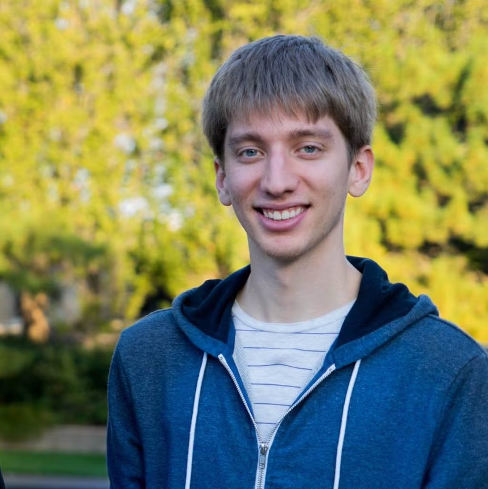

LLM4Eval is colocated with WSDM 2025 in Hannover, Germany and takes place on March 10th-14th, 2025. All times in the table below are according to the local time zone.

| Time          | Agenda                            |
| ------------- | --------------------------------- |
| 9:00 - 9:15   | Opening Remarks                   |
| 9:15 - 10:00  | Keynote 1: __TBD__ |
| 10:00 - 10:30 | Booster Talks 1                  |
| 10:30 - 11:00 | Coffee Break                      |
| 11:00 - 11:30 | Booster Talks 2                  |
| 11:30 - 12:30 | Poster Session                    |
| 12:30 - 13:30 | Lunch                             |
| 13:30 - 14:15 | Keynote 2: __TBD__ |
| 14:15 - 14:30 | LLMJudge Presentation             |
| 14:30 - 14:40 | Discussion Kickoff                |
| 14:40 - 15:00 | Breakout Discussions              |
| 15:00 - 15:30 | Coffee Break                      |
| 15:30 - 15:50 | Breakout Discussion + Shuffling   |
| 15:50 - 16:00 | Breakout Discussion summary       |
| 16:00 - 16:55 | Panel Discussion                  |
| 16:55 - 17:00 | Closing                           |

# Keynotes

## TBD

 __TBA__, TBA

__Abstract.__ TBA

__Bio.__ TBA

## Ambiguity is King. Down with the King!

 __Sean MacAvaney__, University of Glasgow

__Abstract.__ Ambiguity is a central challenge in relevance estimation, whether as a component of a retrieval system or in IR system evaluation. Even seemingly straightforward queries can represent many underlying intents, making relevance estimation inherently ambiguous. I will argue that LLM-based evaluations offer us the chance to (partially) overcome these challenges in ambiguity and provide techniques for doing so.

__Bio.__ __Sean is a Lecturer in Machine Learning at the University of Glasgow and a member of the Terrier Team. He did his PhD at Georgetown University under Nazli Goharian and Ophir Frieder, where he was a member of the IR Lab and an ARCS Endowed Scholar. His research focuses on applying machine learning to problems in IR and NLP. He has done research internships at AI2, CNR, Adobe, and MPI-INF. Before graduate school, he worked as a software developer at IIT/SourceTech.

# Panelists

 __TBA__, TBA

 __TBA__, TBA

 __TBA__, TBA

 __TBA__, TBA